# ✈️ Flight Price Predictor

> End-to-end ML system that predicts Indian domestic flight ticket prices — from raw data to a production-grade REST API deployed on AWS with full MLOps infrastructure.

[](https://www.python.org/)
[](https://fastapi.tiangolo.com/)
[](https://lightgbm.readthedocs.io/)
[](https://mlflow.org/)
[](https://docs.docker.com/compose/)
[](https://aws.amazon.com/)
[]()

---

## 📋 Table of Contents

- [Overview](#overview)
- [Results](#results)
- [Tech Stack](#tech-stack)
- [Project Structure](#project-structure)
- [Quick Start](#quick-start)
- [API Endpoints](#api-endpoints)
- [Screenshots](#screenshots)
- [Model Explainability](#model-explainability)
- [Load Testing](#load-testing)
- [Monitoring](#monitoring)
- [CI/CD Pipeline](#cicd-pipeline)
- [Retraining Pipeline](#retraining-pipeline)

---

## Overview

This project builds a complete ML system from scratch — not just a model, but the full engineering infrastructure around it:

```
Raw CSV data (300k rows)
    → EDA → Preprocessing → Feature Engineering → Target Encoding
    → Baseline Models → Hyperparameter Tuning (Optuna, 50 trials)
    → Model Explainability (SHAP)
    → REST API (FastAPI) → Docker → AWS EC2
    → CI/CD (GitHub Actions + ECR)
    → Monitoring (Grafana + Prometheus + Evidently AI)
    → Retraining Pipeline (champion/challenger pattern)
```

**Dataset:** 300,259 Indian domestic flights (Feb–Mar 2022) across 6 cities and 8 airlines.

**Goal:** Predict exact flight ticket price in INR given flight details.

---

## Results

| Metric | Validation | Test |
|--------|-----------|------|
| **MAE** | 1,514 | **1,504** |
| **RMSE** | 2,920 | **2,894** |
| **R²** | 0.9834 | **0.9837** |

**Best Model:** Tuned LightGBM — 98.37% of price variance explained.

**Model Comparison:**

| Model | Test MAE | Test R² |
|-------|----------|---------|
| LightGBM (champion) | **1,504** | **0.9837** |
| CatBoost | 1,531 | 0.9835 |
| Linear Regression | 4,120 | 0.9167 |

---

## Tech Stack

| Category | Tools |
|----------|-------|
| **ML** | LightGBM, CatBoost, XGBoost, Scikit-learn |
| **Tuning** | Optuna (Bayesian optimization, 50 trials) |
| **Explainability** | SHAP (TreeSHAP) |
| **Experiment Tracking** | MLflow 3.12 |
| **API** | FastAPI + Uvicorn |
| **Validation** | Pydantic v2 |
| **Containerization** | Docker + Docker Compose |
| **Cloud** | AWS EC2, S3, ECR, IAM |
| **CI/CD** | GitHub Actions |
| **Monitoring** | Grafana + Prometheus + Evidently AI |
| **Load Testing** | Locust |
| **Logging** | Loguru |
| **Testing** | pytest (52 tests) |

---

## Project Structure

```
flight-price-predictor/
├── api/
│   ├── main.py              # FastAPI app — endpoints, metrics, model loading
│   └── schemas.py           # Pydantic input/output schemas
├── configs/                 # One config per model (Optuna ranges)
│   ├── lightgbm.py
│   ├── catboost.py
│   ├── xgboost.py
│   └── linear.py
├── monitoring/
│   ├── evidently_monitor.py # Drift detection reports
│   └── reports/             # Generated HTML reports
├── retraining/
│   ├── validate_data.py     # Data quality gate
│   ├── compare_models.py    # Champion vs challenger
│   └── retrain.py           # Main retraining pipeline
├── src/flight_predictor/
│   ├── data_loader.py
│   ├── preprocessor.py
│   ├── feature_engineer.py
│   ├── target_encoder.py
│   ├── trainer.py
│   ├── evaluator.py
│   ├── explainer.py
│   └── logger.py
├── tests/                   # 52 unit tests across 6 files
├── notebooks/               # EDA, preprocessing, training, explainability
├── .github/workflows/
│   ├── deploy.yml           # CI/CD pipeline
│   └── retrain.yml          # Scheduled retraining
├── docker-compose.yml
├── Dockerfile
├── Dockerfile.mlflow
├── prometheus.yml
├── run.py                   # Training entry point
├── locustfile.py            # Load testing scenarios
└── config.yml               # Model hyperparameter ranges
```

---

## Quick Start

### Prerequisites

- Python 3.12
- Conda
- Docker + Docker Compose

### Local Development

```bash
# Clone
git clone https://github.com/your-username/flight-price-predictor
cd flight-price-predictor

# Create environment
conda env create -f environment.yml
conda activate flight-price-predictor

# Install package
pip install -e .

# Run tests
pytest tests/ -v

# Train model
python run.py --model lightgbm

# Start API
uvicorn api.main:app --reload --port 8000
```

### Docker (Full Stack)

```bash
# Start all services (API + MLflow + Prometheus + Grafana)
docker compose up --build

# Services:
# API:        http://localhost:8000
# API Docs:   http://localhost:8000/docs
# MLflow:     http://localhost:5000
# Grafana:    http://localhost:3000  (admin/admin)
# Prometheus: http://localhost:9090
```

---

## API Endpoints

| Method | Endpoint | Description |
|--------|---------|-------------|
| `GET` | `/health` | Health check + model status |
| `GET` | `/metrics` | Prometheus metrics |
| `POST` | `/predict` | Single flight price prediction |
| `POST` | `/predict/batch` | Batch predictions (1-100 flights) |
| `POST` | `/experiment/predict` | Test experimental models |

### Example Request

```bash
curl -X POST http://localhost:8000/predict \
  -H "Content-Type: application/json" \
  -d '{
    "stops_numeric": 0,
    "duration_minutes": 135,
    "departure_hour": 6,
    "arrival_hour": 8,
    "month": 3,
    "day": 2,
    "is_weekend": 0,
    "is_business": 0,
    "airline": "IndiGo",
    "from_city": "Delhi",
    "to_city": "Mumbai"
  }'
```

### Example Response

```json
{
  "predicted_price": 5842.30,
  "currency": "INR",
  "model_version": "lightgbm_model"
}
```

---

## Screenshots

### Test Suite — 52 Tests Passing

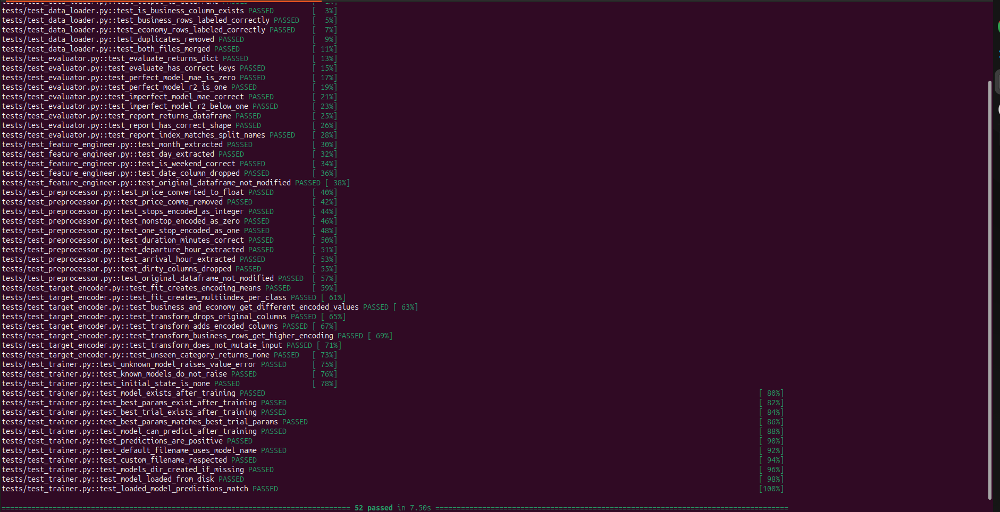

52 unit tests across 6 test files covering all core components:
`DataLoader`, `Preprocessor`, `FeatureEngineer`, `TargetEncoder`, `ModelTrainer`, `ModelEvaluator`.

---

### FastAPI — All Endpoints

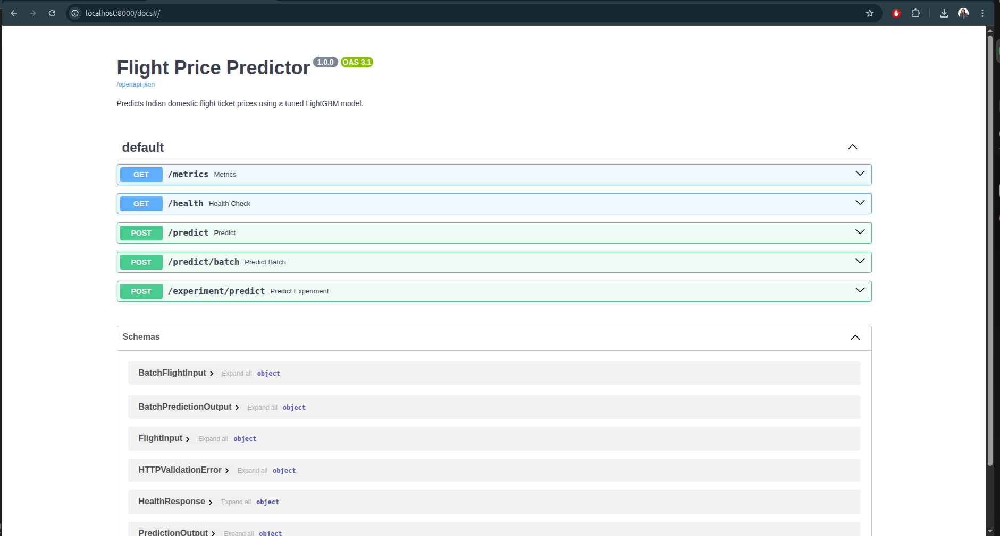

Auto-generated Swagger UI showing all 5 endpoints with full request/response schemas.

---

### API — Live Prediction

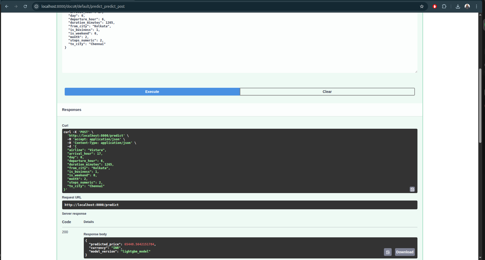

Vistara business class flight Kolkata→Chennai predicted at ₹65,448 — the model correctly identifies this as an expensive business route.

---

### MLflow — Experiment Tracking

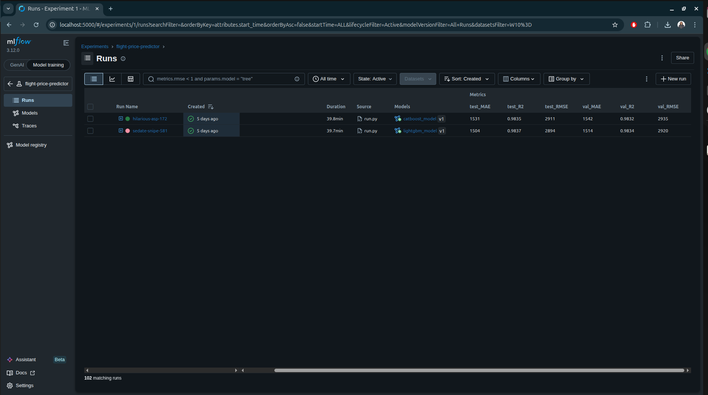

102 runs tracked across LightGBM and CatBoost models. Best LightGBM: test_MAE=1,504, R²=0.9837.

---

### MLflow — Model Registry

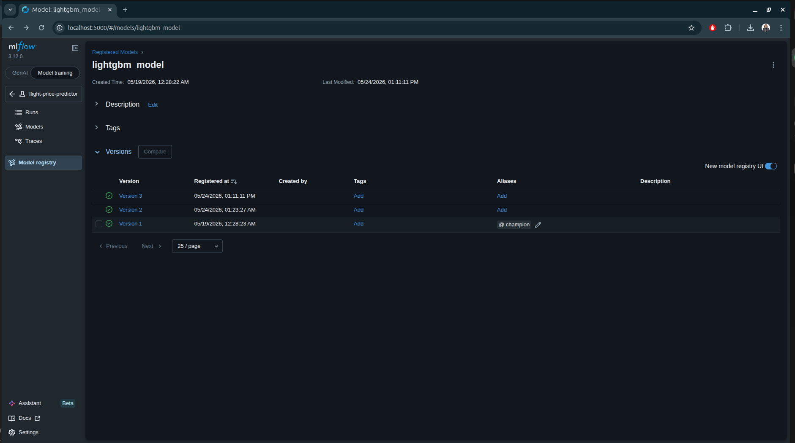

3 registered versions of `lightgbm_model`. Version 1 carries the `@champion` alias — the API loads this version at startup automatically.

---

### Docker — All Containers Running

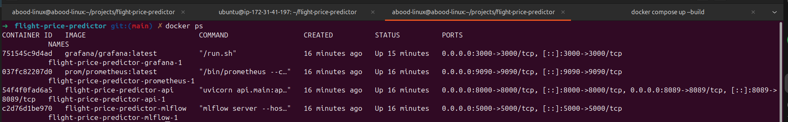

4 services running simultaneously: API (port 8000), MLflow (5000), Prometheus (9090), Grafana (3000).

---

### Grafana — Live Monitoring Dashboard

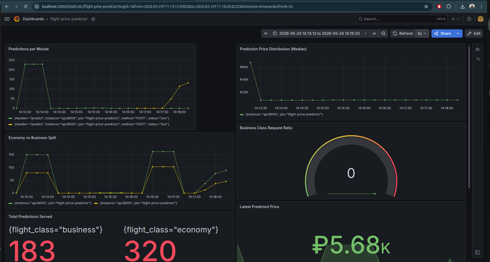

Real-time dashboard showing predictions per minute, economy vs business split, prediction price distribution, business class ratio gauge, and total predictions served (business: 183, economy: 320).

---

### Prometheus — Target Health

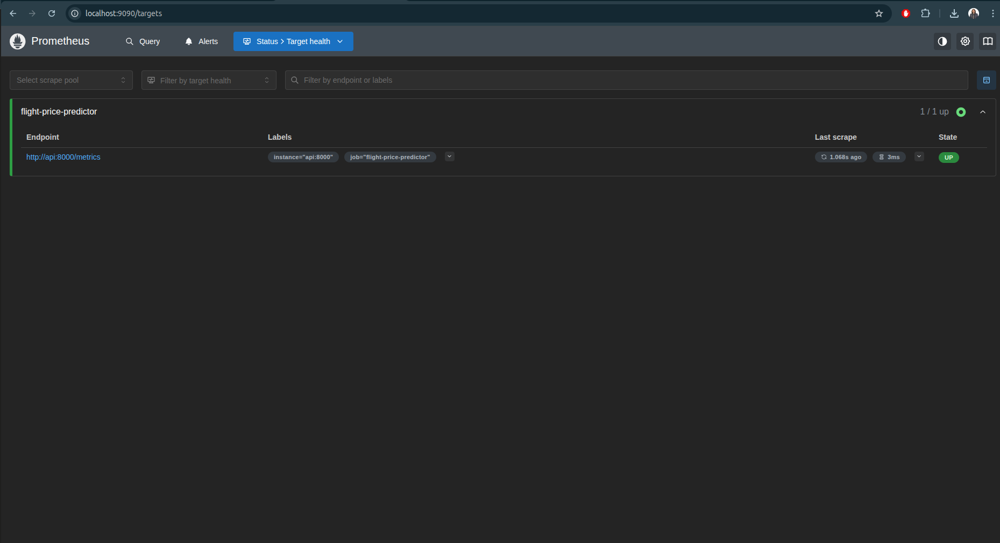

Prometheus scraping the API's `/metrics` endpoint every 15 seconds. Status: UP, last scrape: 1.068s ago, duration: 3ms.

---

## Model Explainability

### SHAP Feature Importance (Bar)

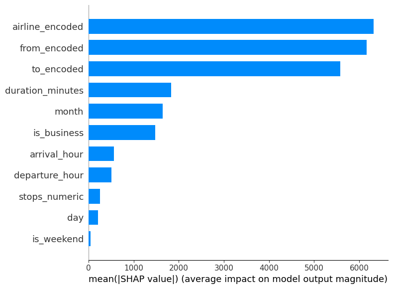

`airline_encoded`, `from_encoded`, and `to_encoded` dominate — route and airline are the strongest price signals. `is_business` has substantial impact despite being binary.

---

### SHAP Feature Impact (Dot Plot)

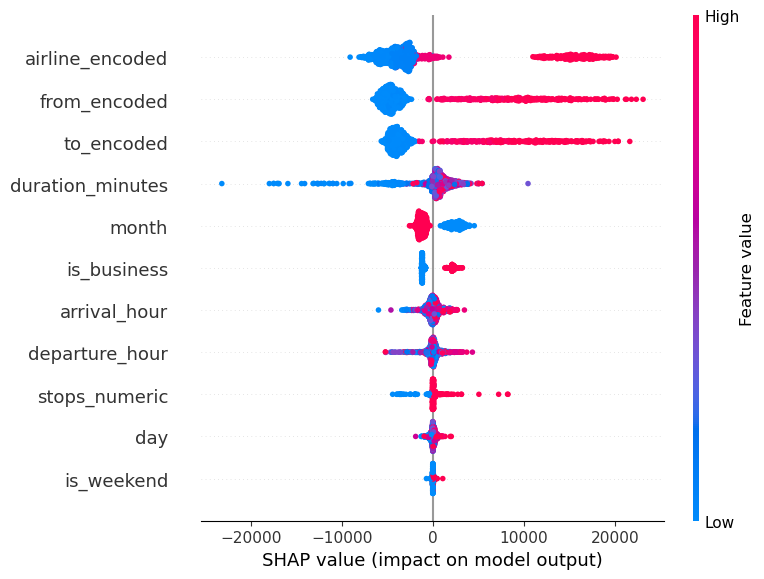

High `airline_encoded` values (premium airlines) push prices up dramatically (right, pink). Low values (budget airlines) pull prices down. `duration_minutes` shows clear positive relationship — longer flights cost more.

---

### SHAP Waterfall — Single Prediction

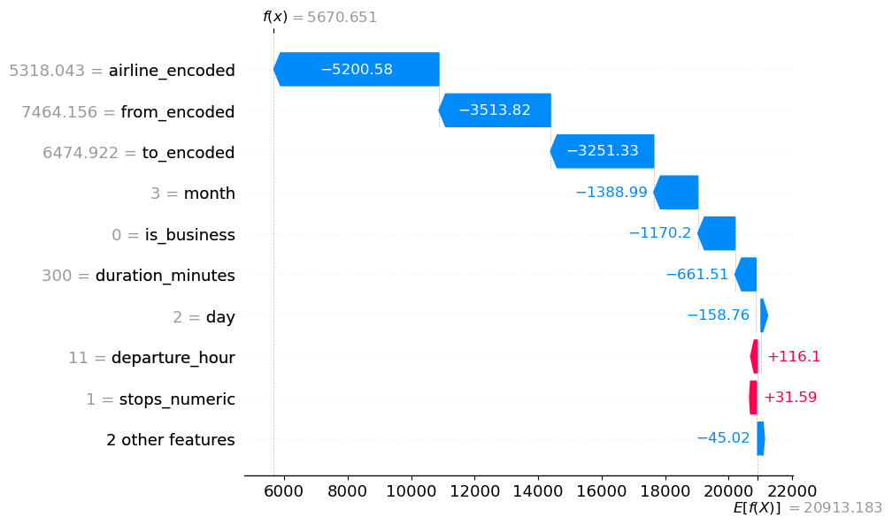

Single prediction explanation. Starting from the mean price (₹20,913), each feature pushes the prediction toward the final value. `airline_encoded` pulls down ₹5,200 (budget airline), while `departure_hour` pushes up slightly.

---

## Load Testing

Load tested with Locust simulating realistic user behavior (70% economy, 20% business, 10% batch users).

### Baseline — 10 Users

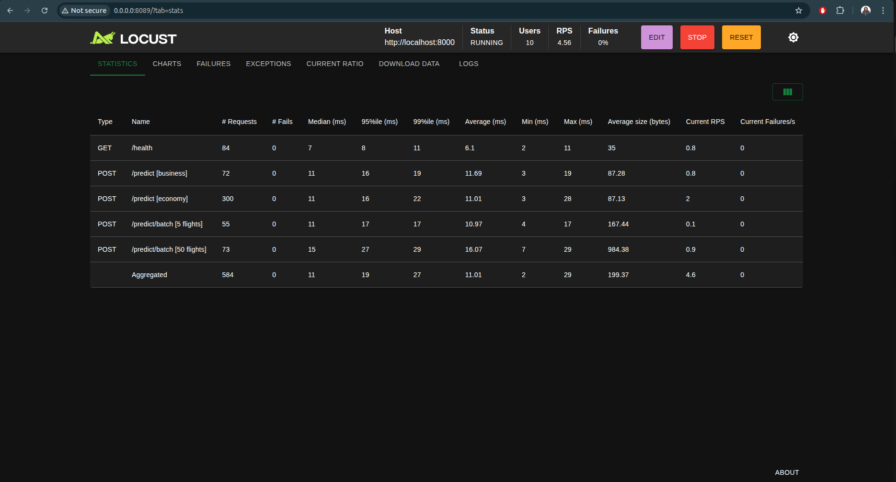

| Endpoint | Median | p99 | Failures |
|----------|--------|-----|----------|
| /health | 7ms | 11ms | 0% |
| /predict [economy] | 11ms | 22ms | 0% |
| /predict [business] | 11ms | 19ms | 0% |
| /predict/batch [50] | 15ms | 29ms | 0% |

---

### Stress Test — 200 Users

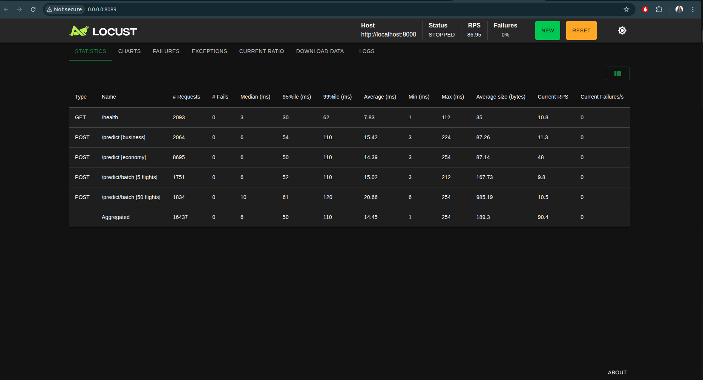

| Endpoint | Median | p99 | RPS | Failures |
|----------|--------|-----|-----|----------|
| /predict [economy] | 6ms | 110ms | 48 | 0% |
| /predict/batch [50] | 10ms | 120ms | 10.5 | 0% |
| Aggregated | 6ms | 110ms | 90.4 | **0%** |

---

### Spike Test — 150 Users (Instant)


All 150 users spawn simultaneously. Median stays at 6ms but p99 spikes to 560ms during the initial shock — the API absorbs the burst with 0% failures.

---

### Breaking Point — 1000 Users

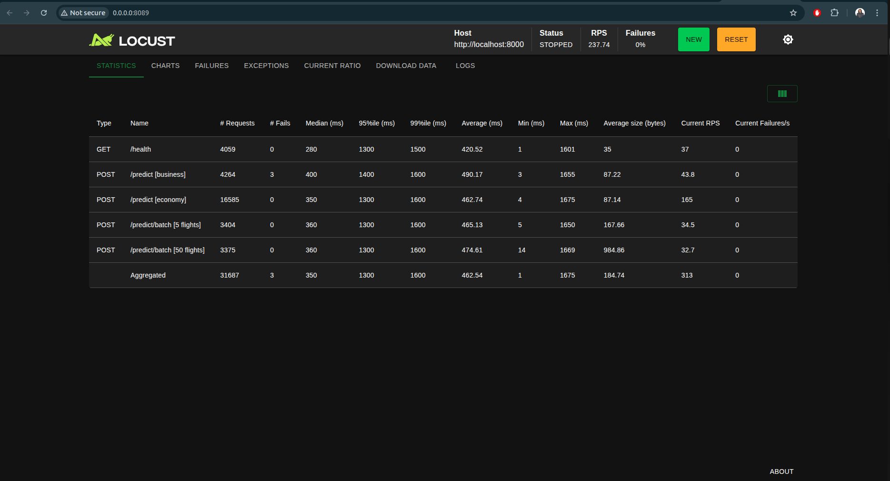

| Metric | Value |
|--------|-------|
| RPS | 237 |
| Failures | 0.009% (3/31,687) |
| Median latency | 350ms |
| p99 latency | 1,600ms |

API handled 1,000 concurrent users with near-zero failures. Breaking point is latency degradation at ~700+ users — a single `--workers 4` flag in the Dockerfile would extend this to 2,000+ users.

---

## Monitoring

### Evidently AI — Data Drift Report

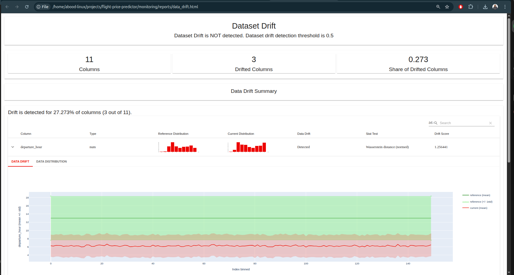

Simulated drift run: 3/11 features drifted. `departure_hour` shows Wasserstein distance of 1.256 — far above the 0.1 threshold. Reference (training) vs current (simulated) distributions clearly separated.

---

### Evidently AI — Test Suite

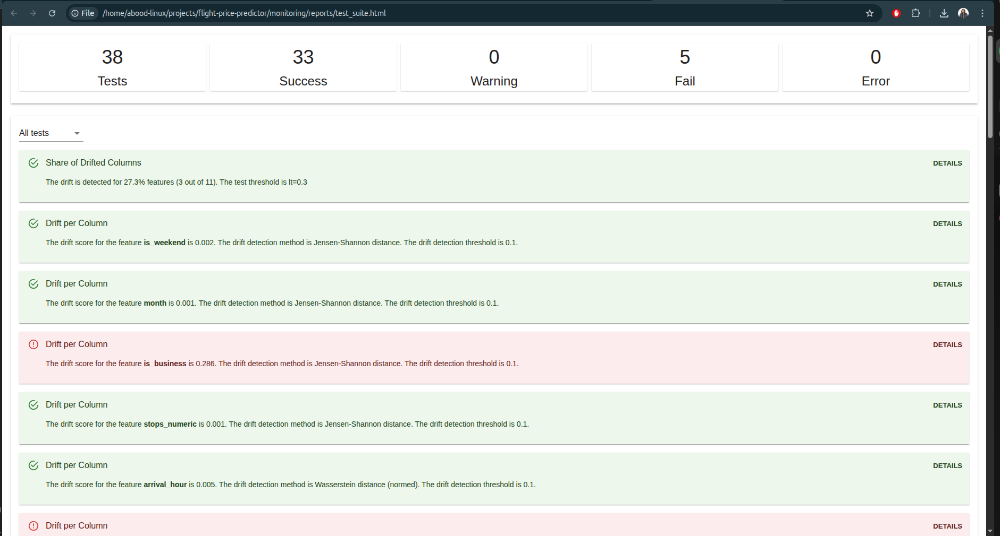

38 automated tests: 33 passed, 5 failed (simulated drift detected). `is_business` scored 0.286 on Jensen-Shannon distance — drift confirmed in the class distribution.

---

### Drift Detection Pipeline

```bash
# Run monitoring (baseline — no drift expected)
python monitoring/evidently_monitor.py

# Run with simulated drift
python monitoring/evidently_monitor.py --simulate
```

Reports generated:
- `monitoring/reports/data_drift.html` — feature distribution comparisons
- `monitoring/reports/data_quality.html` — data health
- `monitoring/reports/target_drift.html` — prediction distribution
- `monitoring/reports/test_suite.html` — automated pass/fail

---

## CI/CD Pipeline

Every push to `main` automatically:


```
git push origin main
    ↓
GitHub Actions triggers
    ↓
52 tests run → if fail → stop (never deploy broken code)
    ↓
Build API + MLflow Docker images on GitHub runner
    ↓
Push both images to Amazon ECR
    ↓
SSH into EC2 → git pull → docker pull → docker compose up
    ↓
Health check → if fail → automatic rollback
    ↓
New code live in ~5 minutes
```

**GitHub Secrets required:**

| Secret | Description |
|--------|-------------|
| `AWS_ACCESS_KEY_ID` | IAM user credentials |
| `AWS_SECRET_ACCESS_KEY` | IAM user credentials |
| `ECR_REGISTRY` | ECR registry URI |
| `EC2_HOST` | EC2 public IP |
| `EC2_SSH_KEY` | EC2 private key (.pem contents) |

---

## Retraining Pipeline

Champion/challenger pattern — new model only replaces production if it's meaningfully better (2%+ MAE improvement).

```bash
# Retrain on existing data
python retraining/retrain.py --use-existing

# Retrain with new data
python retraining/retrain.py --data-path data/raw/new_flights.csv

# Emergency rollback
python retraining/retrain.py --rollback
docker compose restart api
```

**Pipeline steps:**
1. Validate new data (schema, nulls, price range, size)
2. Preprocess (combine old + new, encode)
3. Train challenger (50 Optuna trials)
4. Evaluate on held-out test set
5. Compare vs champion (2% threshold)
6. Promote if better (update MLflow alias)
7. Restart API (loads new champion automatically)
8. Monitor 48h (rollback if unstable)

**Scheduled retraining:** GitHub Actions cron runs on the 1st of every month at 2am automatically.

---

## Feature Engineering

| Feature | Description |
|---------|-------------|
| `is_business` | 1 = business class, 0 = economy |
| `stops_numeric` | 0 = non-stop, 1 = 1 stop, 2 = 2+ stops |
| `duration_minutes` | Total flight duration |
| `departure_hour` | Hour of departure (0–23) |
| `arrival_hour` | Hour of arrival (0–23) |
| `month` | 2 = February, 3 = March |
| `day` | 0 = Monday, 6 = Sunday |
| `is_weekend` | 1 if Saturday or Sunday |
| `airline_encoded` | Mean price per airline per class (target encoded) |
| `from_encoded` | Mean price per origin city per class |
| `to_encoded` | Mean price per destination city per class |

---

## Known Limitations

- Dataset covers only 49 days (Feb–Mar 2022) — seasonal patterns not captured
- No booking lead time feature (not available in source data)
- Target encoding collapses airline cardinality — new airlines get global mean
- Model trained on 2022 prices — production use requires retraining on fresh data

---

## License

MIT License — see [LICENSE](LICENSE) for details.
